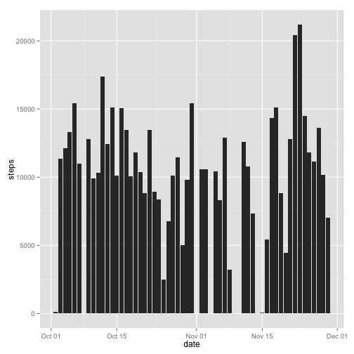
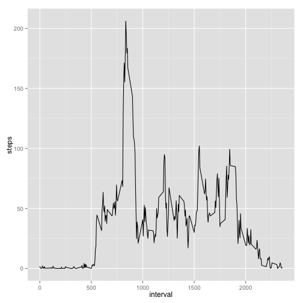
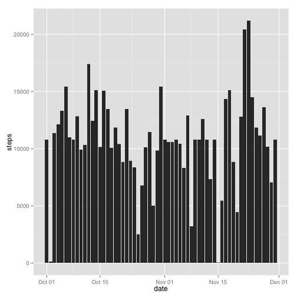
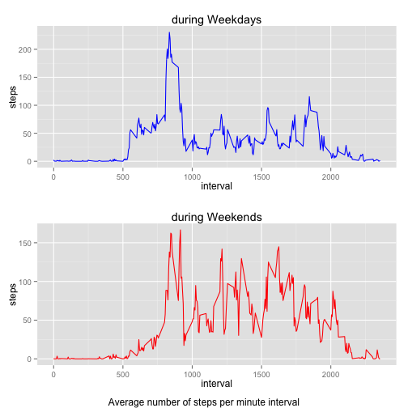

## Loading and preprocessing the data


```r
setwd("/Users/marou/dev/dataScienceCoursera/course4/RepData_PeerAssessment1")
data <- read.csv("activity.csv", colClasses = c("numeric", "Date", "numeric"))
str(data)
```

```
## 'data.frame':	17568 obs. of  3 variables:
##  $ steps   : num  NA NA NA NA NA NA NA NA NA NA ...
##  $ date    : Date, format: "2012-10-01" "2012-10-01" ...
##  $ interval: num  0 5 10 15 20 25 30 35 40 45 ...
```

## What is mean total number of steps taken per day?

Total number of steps taken per day : 

```r
library(ggplot2)
stepsPerDay <- aggregate(steps ~ date, data, FUN=sum)
head(stepsPerDay)
```

```
##         date steps
## 1 2012-10-02   126
## 2 2012-10-03 11352
## 3 2012-10-04 12116
## 4 2012-10-05 13294
## 5 2012-10-06 15420
## 6 2012-10-07 11015
```

```r
summary(stepsPerDay)
```

```
##       date                steps      
##  Min.   :2012-10-02   Min.   :   41  
##  1st Qu.:2012-10-16   1st Qu.: 8841  
##  Median :2012-10-29   Median :10765  
##  Mean   :2012-10-30   Mean   :10766  
##  3rd Qu.:2012-11-16   3rd Qu.:13294  
##  Max.   :2012-11-29   Max.   :21194
```

Histogram of the total number of steps taken each day :

```r
ggplot(stepsPerDay, aes(x = date, y = steps)) + geom_bar(stat = "identity")
```

 

Mean and Median of the total number of steps taken per day : 

```r
mean(stepsPerDay$steps)
```

```
## [1] 10766.19
```

```r
median(stepsPerDay$steps)
```

```
## [1] 10765
```


## What is the average daily activity pattern?


```r
stepsPer5min <- aggregate(steps ~ interval, data, FUN=mean)
ggplot(stepsPer5min, aes(interval, steps)) + geom_line()
```

 


5-minute interval containing the maximum number of steps, on average : 

```r
stepsPer5min [stepsPer5min$steps == max(stepsPer5min$steps),]
```

```
##     interval    steps
## 104      835 206.1698
```

## Imputing missing values

Number of NA :

```r
sum(is.na(data))
```

```
## [1] 2304
```

```r
sum(is.na(data$steps))
```

```
## [1] 2304
```
All the missing data is in steps (which is logical :)

```r
newDataFrame <- data 
newDataFrame$meanIntervals = stepsPer5min$steps
newDataFrame$steps <- with(newDataFrame, ifelse(is.na(newDataFrame$steps), newDataFrame$meanIntervals, newDataFrame$steps))
newDataFrame$meanIntervals = NULL
str(newDataFrame)
```

```
## 'data.frame':	17568 obs. of  3 variables:
##  $ steps   : num  1.717 0.3396 0.1321 0.1509 0.0755 ...
##  $ date    : Date, format: "2012-10-01" "2012-10-01" ...
##  $ interval: num  0 5 10 15 20 25 30 35 40 45 ...
```

```r
ggplot(newDataFrame, aes(x = date, y = steps)) + geom_bar(stat = "identity")
```

 

Mean and Median of the total number of steps taken per day : 

```r
stepsPerDayNAFree =  aggregate(steps ~ date, newDataFrame, FUN=sum)
mean(stepsPerDayNAFree$steps)
```

```
## [1] 10766.19
```

```r
median(stepsPerDayNAFree$steps)
```

```
## [1] 10766.19
```

NAs lower the median, since they must be ignored by the mean/median functions

## Are there differences in activity patterns between weekdays and weekends?


```r
library(grid)
library(gridExtra)

isWeekend <- function(x) {
  if(weekdays(x) %in% c("Sunday","Saturday")) {
    return ("weekend")
  } else {
    return ("weekday")
    }
  }
newDataFrame$isWeekend <- factor(sapply(newDataFrame$date, FUN=isWeekend))
str(newDataFrame$isWeekend)
```

```
##  Factor w/ 2 levels "weekday","weekend": 1 1 1 1 1 1 1 1 1 1 ...
```

```r
weekdaystepsPer5min <- aggregate(steps ~ interval, newDataFrame[newDataFrame$isWeekend =="weekday",], FUN=mean)
weekendstepsPer5min <- aggregate(steps ~ interval, newDataFrame[newDataFrame$isWeekend =="weekend",], FUN=mean)

p1 = ggplot(weekdaystepsPer5min, aes(x = interval, y = steps)) + geom_line(color="blue") + ggtitle("during Weekdays")
p2 = ggplot(weekendstepsPer5min, aes(x = interval, y = steps)) + geom_line(color="red") +  ggtitle("during Weekends")
grid.arrange(p1, p2, ncol=1, nrow =2, bottom="Average number of steps per minute interval")
```

 

